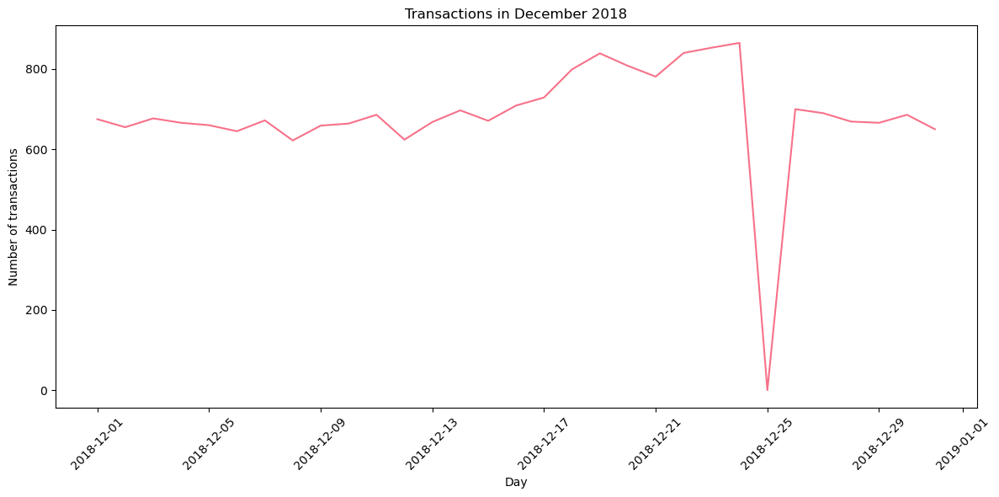
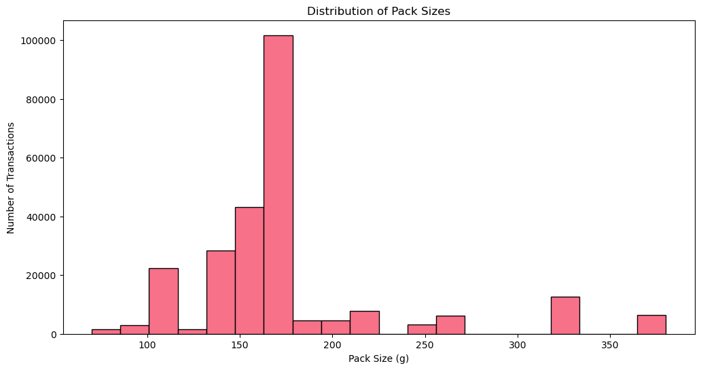
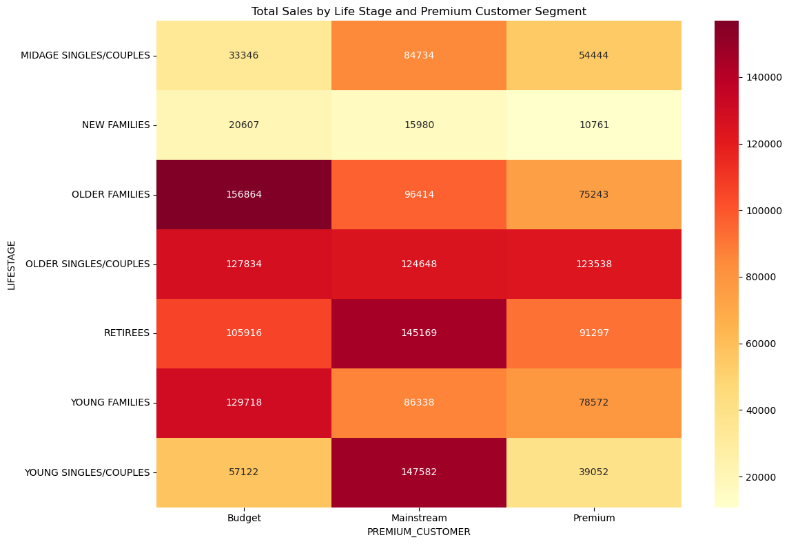
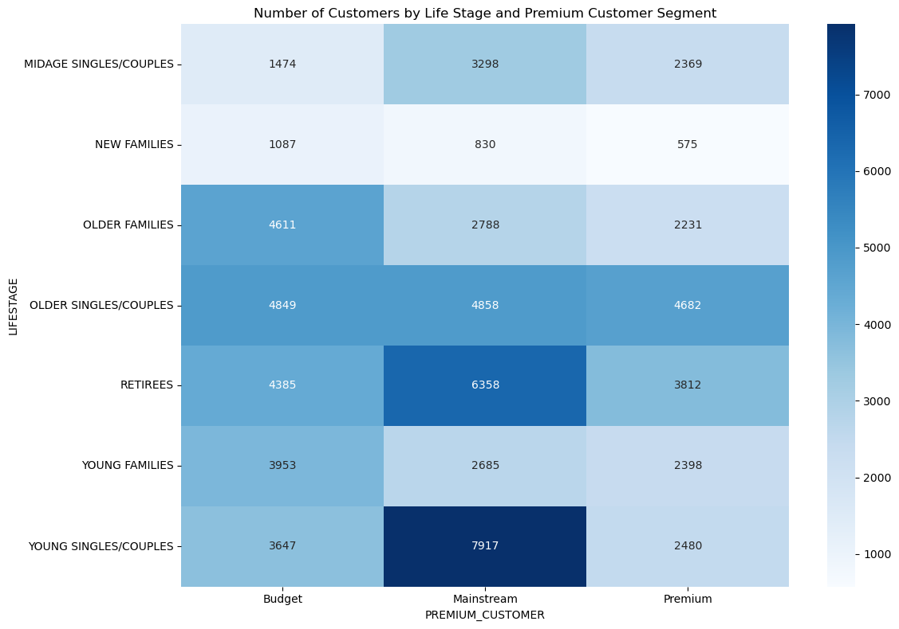
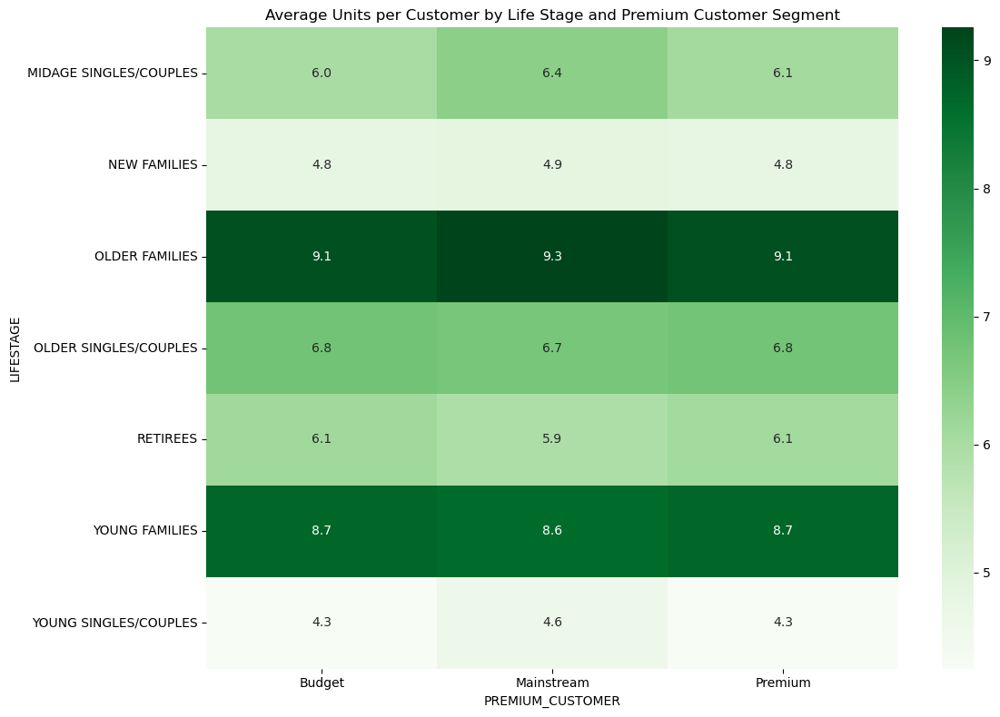
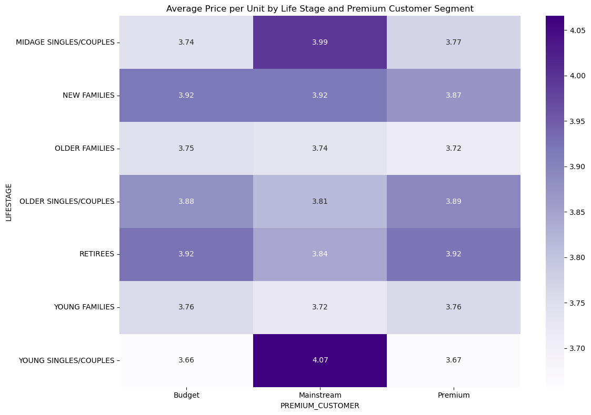
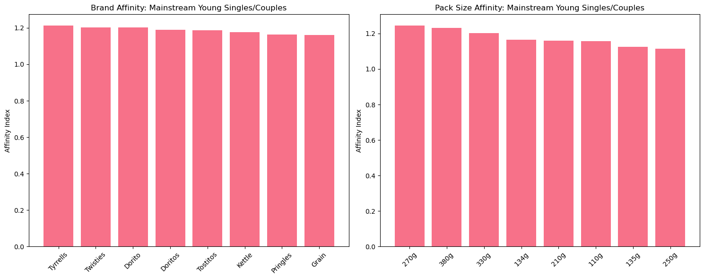

# Quantium Analytics: Chip Purchase Behavior Analysis

## Project Overview

This project analyzes customer purchasing behavior for chip products to provide strategic recommendations for category management. The analysis focuses on understanding customer segments and their purchasing patterns to inform commercial strategy.

<div align="center">
  
</div>

## Business Context

**Client**: Julia (Category Manager)  
**Objective**: Analyze chip purchasing trends and behaviors across customer segments to support upcoming category review  
**Key Focus**: Customer segmentation and purchasing behavior metrics with commercial applications

## Dataset Description

### Transaction Data (`QVI_transaction_data.xlsx`)
- **Records**: 246,740 transactions (after data cleaning)
- **Time Period**: July 1, 2018 - June 30, 2019
- **Key Fields**:
  - `DATE`: Transaction date
  - `STORE_NBR`: Store identifier
  - `LYLTY_CARD_NBR`: Customer loyalty card number
  - `PROD_NAME`: Product name
  - `PROD_QTY`: Quantity purchased
  - `TOT_SALES`: Total sales amount

### Customer Data (`QVI_purchase_behaviour.csv`)
- **Records**: 72,637 unique customers
- **Key Fields**:
  - `LYLTY_CARD_NBR`: Customer loyalty card number
  - `LIFESTAGE`: Customer life stage (7 categories)
  - `PREMIUM_CUSTOMER`: Customer price sensitivity (Budget/Mainstream/Premium)

## Data Quality & Cleaning

### Issues Identified & Resolved
1. **Outlier Removal**: Removed customer 226000 with unusually high purchase quantities (200 packets)
2. **Product Filtering**: Excluded salsa products to focus on chip analysis
3. **Date Conversion**: Converted Excel date format to proper datetime
4. **Brand Standardization**: Standardized brand names (e.g., "RED" → "RRD")

### Final Dataset Statistics
- **Transactions**: 246,740
- **Unique Products**: 114
- **Unique Customers**: 72,637
- **Date Range**: 365 days
- **Pack Sizes**: 70g - 380g

## Key Features Engineered

### Derived Variables
- **`PACK_SIZE`**: Extracted package size in grams from product names
- **`BRAND`**: Extracted brand name from product names
- **`PRICE_PER_UNIT`**: Calculated price per unit (TOT_SALES / PROD_QTY)

### Customer Segments
- **Life Stages**: Young Singles/Couples, Midage Singles/Couples, Young Families, Older Families, Retirees, New Families, Older Singles/Couples
- **Premium Categories**: Budget, Mainstream, Premium

## Analysis Framework

This comprehensive analysis was structured around four key analytical approaches to understand customer purchasing behavior in the chips category. The exploratory data analysis phase examined temporal patterns in transaction volumes over time, revealing seasonal trends and identifying key purchasing periods. 



The temporal analysis clearly demonstrates the seasonal purchasing patterns, with transaction volumes steadily increasing throughout December 2018, reaching peak levels just before Christmas, followed by a complete drop to zero transactions on Christmas Day itself due to store closures. This pattern validates the importance of seasonal planning and inventory management strategies.

Product distribution analysis focused on understanding pack size preferences and brand popularity across the customer base, while customer behavior analysis investigated purchase quantities and shopping frequencies to identify distinct behavioral patterns.



The pack size distribution reveals that the majority of transactions involve medium-sized packages around 170g, with significantly fewer transactions for both smaller and larger pack sizes. This distribution pattern provides crucial insights for product portfolio optimization and shelf space allocation decisions.

The customer segment analysis formed the core of the investigation, examining four critical metrics across all customer segments. Total sales analysis revealed which segments generate the most revenue for the business, while customer count analysis determined the relative size of each segment. Average units per customer provided insights into purchase intensity and shopping behavior, and average price per unit served as an indicator of price sensitivity across different customer groups. This multi-faceted approach enabled a comprehensive understanding of how different customer segments contribute to overall business performance.

Statistical testing was employed to validate observed differences between customer segments, specifically comparing mainstream customers against budget and premium segments regarding their price sensitivity. The analysis revealed a statistically significant difference with a p-value less than 0.05 and a t-statistic of 37.83, confirming that mainstream customers exhibit distinct pricing behavior compared to other segments.

The deep dive analysis focused specifically on the Mainstream Young Singles/Couples segment, which emerged as a key target group. This detailed examination included brand affinity analysis to understand preference patterns, pack size preference analysis to identify optimal product offerings, and the development of commercial insights that translate analytical findings into actionable business recommendations.

## Key Findings

### Data Quality and Outlier Management

The initial data exploration revealed that while the dataset contained no null values, there was a significant outlier in product quantity where 200 packets of chips were purchased in single transactions. Investigation revealed that these unusual transactions were made by the same customer (loyalty card number 226000) on two separate occasions, both involving Dorito Corn Chip Supreme 380g packages. Further analysis showed this customer had no other transaction history, suggesting commercial rather than retail purchasing behavior. This customer was subsequently removed from the analysis to ensure accurate representation of typical retail customer behavior.

### Temporal and Seasonal Patterns

The analysis revealed distinct seasonal purchasing patterns, with sales increasing significantly in the lead-up to Christmas, followed by zero sales on Christmas Day itself due to store closures. This pattern indicates the importance of seasonal planning and inventory management for the chips category, particularly during peak holiday periods when demand surges.

### Customer Segment Performance



The customer segment analysis revealed that revenue generation is concentrated among specific demographic groups. The heatmap clearly shows that Older Families in the Budget segment (dark red, $156,864) and Young Singles/Couples in the Mainstream segment (dark red, $147,582) represent the highest revenue-generating segments. Mainstream Retirees also contribute significantly with $145,169 in total sales, making them the top three revenue-generating segments.



The analysis of customer counts revealed that Mainstream Young Singles/Couples (7,917 customers) and Mainstream Retirees (6,358 customers) represent the largest customer bases purchasing chips. For the Budget Older Families segment, however, higher sales appear to be driven more by purchase intensity rather than customer volume, suggesting different underlying purchasing motivations across segments.



Purchase intensity analysis showed that Older Families and Young Families generally purchase more chips per customer, with Older Families achieving the highest average of 9.3 units per customer across all premium segments. This behavior pattern suggests that family-oriented segments use chips for household consumption and entertaining, leading to higher volume purchases.

### Price Sensitivity and Purchasing Behavior



Price sensitivity analysis revealed significant behavioral differences across customer segments. The heatmap shows that Mainstream Young Singles/Couples demonstrate the highest willingness to pay premium prices at $4.07 per unit (darkest purple), which represents a statistically significant difference compared to budget and premium customer segments. Mainstream Midage Singles/Couples also show elevated price tolerance at $3.99 per unit. This premium pricing acceptance suggests impulse buying behavior among mainstream customers, particularly younger demographics who may prioritize convenience and brand preferences over price optimization.

The analysis indicated that mainstream midage and young singles and couples are consistently more willing to pay higher prices per packet compared to their budget and premium counterparts. This counterintuitive finding regarding premium customers may reflect their tendency to purchase healthier snack alternatives, with chip purchases primarily for entertainment purposes rather than regular consumption.

### Brand Affinity and Product Preferences



The deep dive into Mainstream Young Singles/Couples revealed distinct brand and pack size preferences that significantly exceed population averages. The brand affinity analysis shows Tyrrells leading with the highest affinity index (1.21), followed closely by Twisties (1.20), Doritos (1.19), and Kettle (1.18). These preferences indicate strong brand loyalty within this segment and present opportunities for targeted marketing and merchandising strategies.

Pack size analysis revealed that this target segment shows strong preferences for larger pack sizes, with 270g packages showing the highest affinity index (1.25), followed by 380g packages (1.23) and 330g packages (1.20). Interestingly, the 270g preference appears to be entirely driven by Twisties brand, which is the only manufacturer offering this specific pack size, suggesting that pack size preferences may be influenced by brand availability and positioning.

### Commercial Implications

The analysis findings suggest that Mainstream Young Singles/Couples represent a high-value target segment due to their combination of large customer base, willingness to pay premium prices, and strong brand preferences. Their 23% higher likelihood to purchase Tyrrells chips compared to the general population, combined with their preference for larger pack sizes, indicates significant opportunities for category growth through strategic product placement and merchandising.

The recommendation centers on leveraging these insights through off-location placement of Tyrrells and smaller pack sizes in discretionary spaces frequented by young singles and couples. This strategy aims to capitalize on their demonstrated impulse buying behavior while increasing product visibility in relevant shopping environments. The statistical significance of their different purchasing behavior provides confidence that targeted interventions will yield measurable results, setting the foundation for trial measurement and impact assessment in subsequent analytical phases.

## Strategic Recommendations

### 1. Target Segment Focus
- **Primary Target**: Mainstream Young Singles/Couples
- **Rationale**: High revenue generation, premium price tolerance, distinct preferences

### 2. Product Strategy
- **Brand Portfolio**: Strengthen premium offerings (Tyrrells, Kettle)
- **Pack Size Optimization**: Focus on larger pack sizes (270g, 330g, 380g)
- **Premium Positioning**: Leverage willingness to pay higher prices

### 3. Commercial Applications
- **Category Planning**: Allocate shelf space based on segment preferences
- **Pricing Strategy**: Maintain premium pricing for target segments
- **Promotional Focus**: Target high-affinity brands to key segments

## Technical Implementation

### Tools & Libraries Used
```python
import pandas as pd
import numpy as np
import matplotlib.pyplot as plt
import seaborn as sns
from scipy import stats
```

### Analysis Workflow
1. **Data Loading & Validation**
2. **Exploratory Data Analysis**
3. **Feature Engineering**
4. **Customer Segmentation**
5. **Statistical Testing**
6. **Insight Generation**
7. **Visualization & Reporting**

## Files Structure
```
├── LICENSE
│
├── README.md                     # The top-level README for developers using this project
│
├── data/
│   ├── processed/                # The final, canonical data sets for modeling
│   └── raw/                      # The original, immutable data dump
│       ├── QVI_transaction_data.xlsx    # Transaction data
│       └── QVI_purchase_behaviour.csv   # Customer data
│
├── notebooks/                    # Jupyter notebooks for EDA
│   └── feature_analysis.ipynb    # Main EDA analysis notebook
│ 
│
├── figures/                      # Generated graphics and figures to be used in reporting
│
├── img/                          # Project related files
│
└── requirements.txt              # The requirements file for reproducing the analysis environment
```

## Usage Instructions

1. **Data Preparation**: Load both transaction and customer datasets
2. **Run Cleaning**: Execute data quality and cleaning procedures
3. **Feature Engineering**: Create derived variables (pack size, brand, price per unit)
4. **Analysis**: Run customer segmentation and affinity analysis
5. **Visualization**: Generate charts for business presentation

## Business Impact

This analysis provides Julia with:
- **Data-driven insights** for category review
- **Specific recommendations** for product portfolio
- **Customer segment strategies** for revenue optimization
- **Statistical validation** of findings for confident decision-making

## Next Steps

1. **Deeper Segmentation**: Further analyze sub-segments within target groups
2. **Seasonality Analysis**: Investigate seasonal purchasing patterns
3. **Store-level Analysis**: Understand geographic/store-specific trends
4. **Competitive Analysis**: Compare against industry benchmarks

---

*Analysis completed as part of Quantium Analytics virtual experience program*
